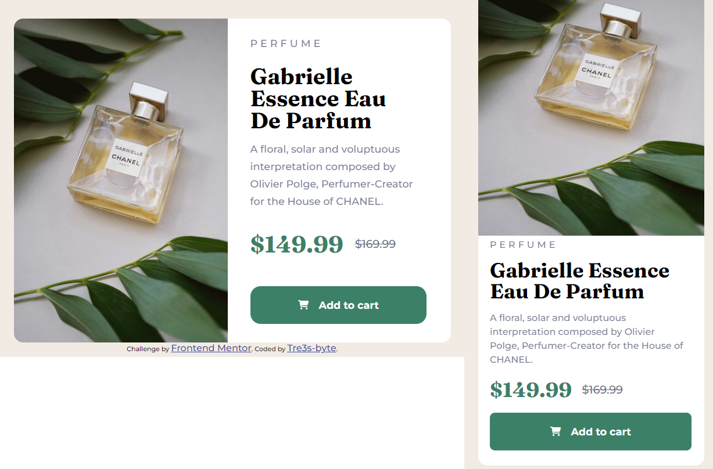

# Frontend Mentor - Product preview card component solution

This is a solution to the [Product preview card component challenge on Frontend Mentor](https://www.frontendmentor.io/challenges/product-preview-card-component-GO7UmttRfa). Frontend Mentor challenges help you improve your coding skills by building realistic projects.

## Table of contents

- [Overview](#overview)
  - [The challenge](#the-challenge)
  - [Screenshot](#screenshot)
  - [Links](#links)
- [My process](#my-process)
  - [Built with](#built-with)
  - [What I learned](#what-i-learned)
  - [Continued development](#continued-development)
  - [Useful resources](#useful-resources)
- [Author](#author)
- [Acknowledgments](#acknowledgments)

### The challenge

Users should be able to:

- View the optimal layout depending on their device's screen size
- See hover and focus states for interactive elements

### Screenshot

### Links

- Solution URL: [Add solution URL here](https://github.com/Tre3s-byte/product-preview-card-component-main)
- Live Site URL: [Add live site URL here](https://inquisitive-phoenix-363018.netlify.app)

## My process

### Built with

- Semantic HTML5 markup
- Sass
- Flexbox
- CSS Grid

### What I learned

Overall, this is my first time using Sass, and I really enjoyed working with it. It made everything easier because it is well organized. The possibility to nest and avoid redundancy when creating variables and nesting selectors makes it clearer to understand where you are styling.

### Continued development

I hope I will be able to continue learning SASS using these tests, as well as React and Redux.

### Useful resources

- [Example resource 1](https://www.w3schools.com) - As always is very useful to remember some specific points about some rules that are not so often used
- [Example resource 2](https://developer.mozilla.org/en-US/docs/Web/CSS)

## Author

- Website - [Add your name here](https://www.linkedin.com/in/tre3s-byte/)
- Frontend Mentor - [@yourusername](https://www.frontendmentor.io/profile/Tre3s-byte)
- GitHub - [@yourusername](https://github.com/Tre3s-byte)
